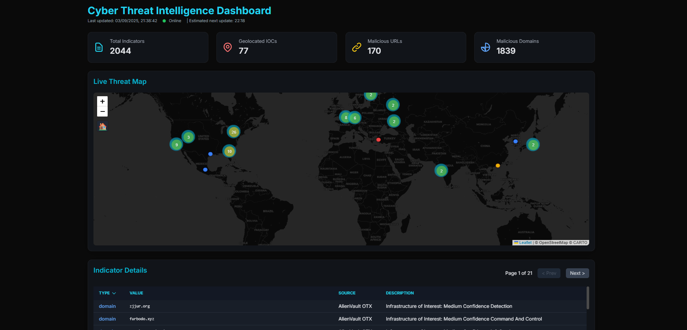
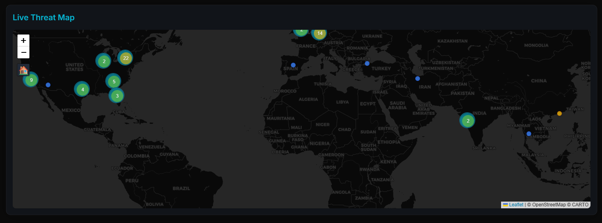
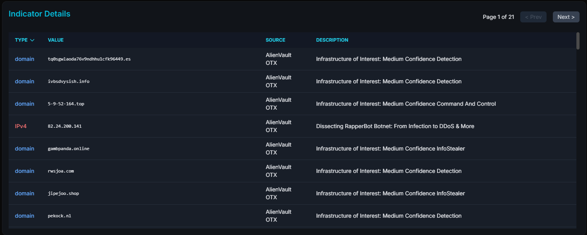

# 🚨 Cyber Threat Intelligence (CTI) Dashboard


A **live, automated dashboard** that aggregates, processes, and visualises real-time **Cyber Threat Intelligence (CTI)** from multiple open-source feeds.

This project provides a **single pane of glass** for security analysts, SOC teams, and cyber professionals to gain rapid situational awareness of current **global cyber threats**.

---

## 📑 Table of Contents

* [Live Demo](#-live-demo)
* [Screenshots](#-screenshots)
* [Project Purpose](#-project-purpose)
* [Features](#-features)
* [Tech Stack](#-tech-stack)
* [How It Works](#-how-it-works)
* [Setup and Deployment](#-setup-and-deployment)
* [Contributing](#-contributing)
* [Licence](#-licence)
* [Inspiration](#-inspiration)

---

## 🌐 Live Demo

🔗 **[View the Dashboard](https://sanilpanchal23.github.io/CTI-DASHBOARD/)**

---

## 📸 Screenshots

| Dashboard Overview                                         | Threat Map                                      | Indicator Table                                 |
| ---------------------------------------------------------- | ----------------------------------------------- | ----------------------------------------------- |
|  |  |  |


## 🎯 Project Purpose

Security analysts often face **information overload**, with dozens of disconnected feeds and indicators.

The **CTI Dashboard** streamlines this process by:

* 🔄 **Aggregating intelligence** from multiple trusted feeds
* 🧹 **Normalising and enriching** data into actionable insights
* 🌍 **Visualising global threats** on an interactive map
* ⚡ **Automating updates** every 30 minutes with CI/CD pipelines

---

## ✨ Features

* **Live Data Feeds** – AlienVault OTX, Feodo Tracker, OpenPhish
* **Automated Updates** – GitHub Actions refresh every 30 minutes
* **Interactive Global Map** – Marker clustering, colour-coded indicators, quick "Home" button
* **Indicator Table** – Paginated, searchable, colour-coded, linked to map
* **Live Status Panel** – Next update timer and auto-refresh
* **Modern Dark Mode UI** – Sleek glassmorphism styling designed for professional use

---

## 🛠️ Tech Stack

* **Backend:** Python (requests, python-dotenv)
* **Frontend:** HTML5, CSS3, JavaScript
* **Libraries:** Leaflet.js, Tailwind CSS
* **Automation:** GitHub Actions (CI/CD), GitHub Pages (deployment)

---

## ⚙️ How It Works

1. **Scheduled Trigger** – GitHub Actions workflow runs every 30 minutes
2. **Data Fetching** – `fetch_threats.py` pulls indicators of compromise (IOCs)
3. **Processing & Enrichment** – Data is shuffled, geolocated, trimmed for clarity
4. **Data Commit** – Processed `data.json` pushed into the repository
5. **Deployment** – GitHub Pages serves the updated dashboard automatically

---

## 🚀 Setup and Deployment

### 🔧 Local Setup

```bash
git clone https://github.com/Sanilpanchal23/CTI-DASHBOARD.git
cd CTI-DASHBOARD
cd backend
python -m venv venv
.\venv\Scripts\activate  # Windows
pip install -r requirements.txt
# Add your OTX API key to .env
python fetch_threats.py
```

Then, open `index.html` in your browser.

### 🌍 Deployment

1. Push the repository to GitHub
2. Add your `OTX_API_KEY` secret in repository settings
3. Configure **GitHub Pages** to serve from the `docs` folder
4. Ensure the workflow `update_threat_data.yml` is enabled

---

## 🤝 Contributing

Contributions are welcome!

1. Fork the repository
2. Create a branch for your feature or fix
3. Submit a pull request with a clear description

For larger changes, open an issue first to discuss ideas.

---

## 📜 Licence

Released under the **MIT Licence**.
See [LICENCE](LICENCE) for details.

---

## 💡 Inspiration

Built to empower **SOC teams and cyber analysts** with a **clear, automated, and actionable view of global threats** — helping them stay one step ahead.

---

✨ **CTI Dashboard – Real-time Cyber Threat Intelligence, Automated and Visualised.**

